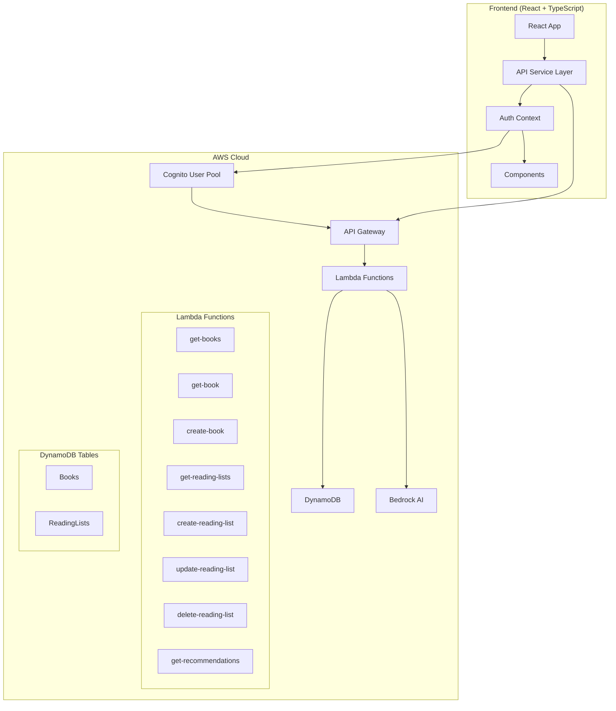
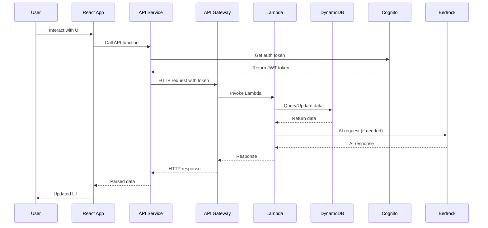

# Design Document: AWS Backend Integration

## Overview

This design outlines the complete integration of AWS backend services with the existing React TypeScript library recommendation system. The system will transition from mock data to a production-ready AWS architecture using Cognito for authentication, DynamoDB for data persistence, Lambda functions for business logic, API Gateway for HTTP routing, and Bedrock for AI-powered recommendations.

The integration follows a phased approach: environment setup, API integration, authentication, data services, AI recommendations, admin features, and finally cleanup of mock implementations.

## Architecture

### High-Level Architecture



### Component Integration Flow



## Components and Interfaces

### Frontend API Service Layer

The existing `src/services/api.ts` will be updated to replace mock implementations with real AWS API calls. Key changes include:

**Environment Configuration:**
- Use `VITE_API_BASE_URL` for API Gateway endpoint
- Use `VITE_AWS_REGION`, `VITE_COGNITO_USER_POOL_ID`, `VITE_COGNITO_CLIENT_ID` for AWS configuration
- Implement proper error handling for missing environment variables

**Authentication Headers:**
- Update `getAuthHeaders()` function to use AWS Amplify's `fetchAuthSession()`
- Include Cognito JWT tokens in all authenticated requests
- Handle token refresh automatically

**API Functions:**
Each API function will follow this pattern:
```typescript
export async function apiFunction(): Promise<ReturnType> {
  if (!API_BASE_URL) {
    throw new Error('API_BASE_URL is not configured');
  }
  
  const headers = await getAuthHeaders();
  const response = await fetch(`${API_BASE_URL}/endpoint`, {
    method: 'GET',
    headers
  });
  
  if (!response.ok) {
    throw new Error(`API call failed: ${response.statusText}`);
  }
  
  return response.json();
}
```

### AWS Lambda Functions

Each Lambda function will be implemented in TypeScript with the following structure:

**Common Lambda Structure:**
```typescript
import { APIGatewayProxyEvent, APIGatewayProxyResult } from 'aws-lambda';
import { DynamoDBClient } from '@aws-sdk/client-dynamodb';
import { DynamoDBDocumentClient } from '@aws-sdk/lib-dynamodb';

const client = new DynamoDBClient({});
const docClient = DynamoDBDocumentClient.from(client);

export const handler = async (
  event: APIGatewayProxyEvent
): Promise<APIGatewayProxyResult> => {
  try {
    // Business logic here
    return {
      statusCode: 200,
      headers: {
        'Content-Type': 'application/json',
        'Access-Control-Allow-Origin': '*'
      },
      body: JSON.stringify(result)
    };
  } catch (error) {
    return {
      statusCode: 500,
      headers: {
        'Content-Type': 'application/json',
        'Access-Control-Allow-Origin': '*'
      },
      body: JSON.stringify({ error: 'Internal server error' })
    };
  }
};
```

**Books API Functions:**
- `get-books`: Scan DynamoDB Books table, return all books
- `get-book`: Get single book by ID from DynamoDB
- `create-book`: Create new book (admin only), validate admin role from Cognito token
- `update-book`: Update existing book (admin only)
- `delete-book`: Delete book (admin only)

**Reading Lists API Functions:**
- `get-reading-lists`: Get user's reading lists using userId from Cognito token
- `create-reading-list`: Create new reading list with auto-generated ID and timestamps
- `update-reading-list`: Update existing reading list (owner only)
- `delete-reading-list`: Delete reading list (owner only)

**AI Recommendations Function:**
- `get-recommendations`: Use Bedrock to generate book recommendations based on user query

### Authentication Integration

**AWS Amplify Configuration:**
Update `src/main.tsx` to configure Amplify:
```typescript
import { Amplify } from 'aws-amplify';

Amplify.configure({
  Auth: {
    Cognito: {
      userPoolId: import.meta.env.VITE_COGNITO_USER_POOL_ID,
      userPoolClientId: import.meta.env.VITE_COGNITO_CLIENT_ID,
      region: import.meta.env.VITE_AWS_REGION
    }
  }
});
```

**AuthContext Updates:**
Update `src/contexts/AuthContext.tsx` to use Cognito functions:
- `signUp()`: Use Cognito's `signUp` function
- `signIn()`: Use Cognito's `signIn` function
- `signOut()`: Use Cognito's `signOut` function
- `getCurrentUser()`: Use Cognito's `getCurrentUser` function

### API Gateway Configuration

**REST API Structure:**
```
GET    /books                    -> get-books Lambda
GET    /books/{id}               -> get-book Lambda
POST   /books                    -> create-book Lambda (admin)
PUT    /books/{id}               -> update-book Lambda (admin)
DELETE /books/{id}               -> delete-book Lambda (admin)

GET    /reading-lists            -> get-reading-lists Lambda
POST   /reading-lists            -> create-reading-list Lambda
PUT    /reading-lists/{id}       -> update-reading-list Lambda
DELETE /reading-lists/{id}       -> delete-reading-list Lambda

POST   /recommendations          -> get-recommendations Lambda
```

**CORS Configuration:**
Enable CORS for all endpoints to allow frontend access from different domains.

**Cognito Authorizer:**
Configure Cognito User Pool as authorizer for protected endpoints.

## Data Models

### DynamoDB Table Schemas

**Books Table:**
```typescript
interface BookItem {
  id: string;                    // Partition Key
  title: string;
  author: string;
  genre: string;
  description: string;
  coverImage: string;
  rating: number;
  publishedYear: number;
  isbn?: string;
  createdAt: string;
  updatedAt: string;
}
```

**ReadingLists Table:**
```typescript
interface ReadingListItem {
  id: string;                    // Partition Key
  userId: string;                // Global Secondary Index
  name: string;
  description?: string;
  bookIds: string[];
  isPublic: boolean;
  createdAt: string;
  updatedAt: string;
}
```

### TypeScript Interfaces

The existing interfaces in `src/types/index.ts` will remain unchanged, ensuring compatibility between frontend and backend data structures.

## Correctness Properties

*A property is a characteristic or behavior that should hold true across all valid executions of a system—essentially, a formal statement about what the system should do. Properties serve as the bridge between human-readable specifications and machine-verifiable correctness guarantees.*

Based on the prework analysis, I've identified the following testable properties that validate the AWS backend integration:

### Configuration Properties

**Property 1: Environment-based API routing**
*For any* valid API base URL configuration, the system should make HTTP requests to that URL instead of returning mock data
**Validates: Requirements 1.1**

**Property 2: AWS region configuration**
*For any* valid AWS region, the AWS SDK should be configured to use that region for all service calls
**Validates: Requirements 1.2**

**Property 3: Authentication mode switching**
*For any* valid Cognito configuration, the system should use Amplify authentication functions instead of mock implementations
**Validates: Requirements 1.3**

**Property 4: Environment validation**
*For any* missing required environment variable, the system should throw a descriptive error message containing the variable name
**Validates: Requirements 1.4**

**Property 5: Invalid URL error handling**
*For any* empty or malformed API base URL, the system should throw a descriptive error instead of failing silently
**Validates: Requirements 1.5**

### API Integration Properties

**Property 6: Books API endpoint routing**
*For any* books API call, the system should make HTTP requests to the correct API Gateway endpoint with proper headers
**Validates: Requirements 2.1, 2.2**

**Property 7: 404 handling for books**
*For any* book ID that returns a 404 response, the getBook function should return null instead of throwing an error
**Validates: Requirements 2.3**

**Property 8: API error message formatting**
*For any* HTTP error response, the system should provide user-friendly error messages that don't expose internal details
**Validates: Requirements 2.4**

**Property 9: Loading state management**
*For any* API call, the system should properly manage loading states using the LoadingSpinner component
**Validates: Requirements 2.5**

### Authentication Properties

**Property 10: Cognito integration**
*For any* authentication operation (signup, login, logout), the system should call the corresponding Cognito function
**Validates: Requirements 3.1, 3.2**

**Property 11: JWT token inclusion**
*For any* authenticated API request, the system should include the Cognito JWT token in the Authorization header
**Validates: Requirements 3.3**

**Property 12: Token refresh handling**
*For any* expired token scenario, the system should attempt automatic token refresh before failing
**Validates: Requirements 3.4**

**Property 13: Authentication error handling**
*For any* authentication failure, the system should provide clear error messages and redirect to login
**Validates: Requirements 3.5**

### Reading Lists Properties

**Property 14: Authenticated reading lists access**
*For any* authenticated user, reading lists operations should include proper authentication headers and user context
**Validates: Requirements 4.1, 4.2, 4.3, 4.4**

**Property 15: Unauthenticated access rejection**
*For any* unauthenticated request to reading lists endpoints, the system should return appropriate authentication errors
**Validates: Requirements 4.5**

### AI Recommendations Properties

**Property 16: Bedrock query formatting**
*For any* recommendation query, the system should send properly formatted requests to the Bedrock-powered Lambda function
**Validates: Requirements 5.1**

**Property 17: Recommendation response structure**
*For any* successful Bedrock response, the returned recommendations should contain title, author, reason, and confidence fields
**Validates: Requirements 5.2, 5.4**

**Property 18: AI service error handling**
*For any* AI service failure or unavailability, the system should handle errors gracefully with appropriate fallback behavior
**Validates: Requirements 5.3, 5.5**

### Admin Authorization Properties

**Property 19: Admin operation authorization**
*For any* admin operation (create, update, delete books), the system should validate admin role from Cognito JWT token claims
**Validates: Requirements 6.1, 6.2, 6.3, 6.5**

**Property 20: Non-admin access rejection**
*For any* non-admin user attempting admin operations, the system should return authorization errors
**Validates: Requirements 6.4**

### Resilience Properties

**Property 21: Retry with exponential backoff**
*For any* API call that times out, the system should retry up to 3 times with exponential backoff
**Validates: Requirements 7.1**

**Property 22: Server error handling**
*For any* 5xx server error, the system should display user-friendly error messages while logging detailed information
**Validates: Requirements 7.2, 7.5**

**Property 23: Network resilience**
*For any* network connectivity loss, the system should cache the last successful state and retry operations when connectivity returns
**Validates: Requirements 7.3, 7.4**

### Migration Properties

**Property 24: Mock data cleanup**
*For any* completed AWS integration, the system should contain no references to mock data imports or functions
**Validates: Requirements 8.1, 8.3**

**Property 25: Build validation after cleanup**
*For any* codebase with mock data removed, the application should build successfully without errors
**Validates: Requirements 8.2**

**Property 26: Data migration completeness**
*For any* initial data migration, DynamoDB should contain all books from the original mock dataset
**Validates: Requirements 8.4**

**Property 27: End-to-end functionality**
*For any* frontend feature, it should work correctly with real backend data after AWS integration
**Validates: Requirements 8.5**

<function_calls>
<invoke name="prework">
<parameter name="featureName">aws-backend-integration

## Error Handling

### Error Categories and Responses

**Configuration Errors:**
- Missing environment variables: Throw descriptive errors with variable names
- Invalid URLs: Provide specific error messages about URL format
- AWS configuration issues: Guide users to check their AWS setup

**API Communication Errors:**
- Network timeouts: Implement retry logic with exponential backoff
- HTTP 4xx errors: Display user-friendly messages based on error type
- HTTP 5xx errors: Show generic "service unavailable" messages while logging details
- CORS issues: Provide clear guidance about API Gateway configuration

**Authentication Errors:**
- Token expiration: Automatically attempt refresh, redirect to login if failed
- Invalid credentials: Clear error messages without exposing security details
- Authorization failures: Distinguish between authentication and authorization errors
- Cognito service errors: Fallback to offline mode where possible

**Data Validation Errors:**
- Invalid API responses: Validate response structure and provide fallback data
- Missing required fields: Handle gracefully with default values
- Type mismatches: Transform data to expected types where possible

### Error Recovery Strategies

**Automatic Recovery:**
- Token refresh for expired authentication
- Retry failed API calls with exponential backoff
- Fallback to cached data during network issues
- Graceful degradation of AI features when Bedrock is unavailable

**User-Initiated Recovery:**
- Manual retry buttons for failed operations
- Clear instructions for resolving configuration issues
- Option to refresh authentication manually
- Ability to clear cached data and retry

## Testing Strategy

### Dual Testing Approach

The testing strategy combines unit tests for specific scenarios with property-based tests for comprehensive validation:

**Unit Tests:**
- Specific examples of API calls with known responses
- Edge cases like empty responses, malformed data
- Error conditions with specific HTTP status codes
- Integration points between components
- Authentication flow with mock Cognito responses

**Property-Based Tests:**
- Universal properties that hold for all inputs
- Configuration validation across different environment setups
- API integration behavior with generated test data
- Error handling across various failure scenarios
- Data transformation consistency

### Property-Based Testing Configuration

**Testing Framework:** Vitest with fast-check for property-based testing
**Test Configuration:**
- Minimum 100 iterations per property test
- Each property test tagged with: **Feature: aws-backend-integration, Property {number}: {property_text}**
- Custom generators for AWS responses, authentication tokens, and API data
- Mock AWS services for isolated testing

**Test Categories:**

1. **Configuration Tests:**
   - Generate various environment variable combinations
   - Test URL validation with malformed inputs
   - Verify AWS SDK configuration with different regions

2. **API Integration Tests:**
   - Generate random API responses and verify parsing
   - Test error handling with various HTTP status codes
   - Validate request formatting and headers

3. **Authentication Tests:**
   - Test token handling with expired/valid tokens
   - Verify authorization header inclusion
   - Test authentication error scenarios

4. **Data Consistency Tests:**
   - Verify data transformation between frontend and backend formats
   - Test CRUD operations maintain data integrity
   - Validate response structure consistency

### Integration Testing

**End-to-End Testing:**
- Complete user workflows from authentication to data operations
- Cross-component integration validation
- Real AWS service integration testing (in staging environment)

**Performance Testing:**
- API response time validation
- Memory usage during large data operations
- Concurrent user simulation

### Test Data Management

**Mock Data Strategy:**
- Maintain mock data during development and testing phases
- Gradual replacement with real AWS integration
- Preserve test data for regression testing

**Test Environment Setup:**
- Separate AWS resources for testing
- Environment-specific configuration
- Automated test data seeding

## Implementation Phases

### Phase 1: Environment Setup
1. Configure environment variables
2. Set up AWS Amplify configuration
3. Validate configuration on startup
4. Update build process for environment validation

### Phase 2: Authentication Integration
1. Install and configure AWS Amplify
2. Update AuthContext with Cognito functions
3. Implement token management and refresh
4. Test authentication flows

### Phase 3: Books API Integration
1. Update getBooks() and getBook() functions
2. Implement admin book management functions
3. Add proper error handling and loading states
4. Test with real Lambda functions

### Phase 4: Reading Lists Integration
1. Update reading lists CRUD operations
2. Implement user-specific data filtering
3. Add authentication to all reading list operations
4. Test data persistence and retrieval

### Phase 5: AI Recommendations
1. Integrate with Bedrock-powered Lambda function
2. Implement proper query formatting and response parsing
3. Add error handling for AI service limitations
4. Test recommendation quality and performance

### Phase 6: Cleanup and Migration
1. Remove all mock data imports and functions
2. Delete mockData.ts file
3. Remove TODO comments and mock implementations
4. Migrate initial data to DynamoDB
5. Comprehensive testing of all features

### Phase 7: Production Readiness
1. Performance optimization
2. Security audit
3. Error monitoring setup
4. Documentation updates
5. Deployment automation

This phased approach ensures incremental progress with validation at each step, minimizing risk and allowing for early detection of integration issues.