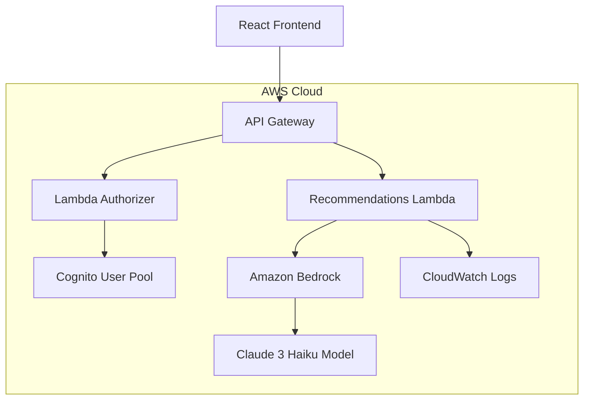

# Design Document: Bedrock AI Integration

## Overview

This design document outlines the implementation of Amazon Bedrock AI integration for generating intelligent book recommendations in the Library Recommendation System. The system will leverage Claude 3 Haiku model to provide cost-effective, fast, and accurate book suggestions based on natural language user queries.

The integration follows a serverless architecture pattern using AWS Lambda, API Gateway, and Bedrock services, with proper authentication through Cognito and comprehensive error handling.

## Architecture

### High-Level Architecture



### Request Flow

1. **User Input**: User enters natural language query in React frontend
2. **Authentication**: Frontend includes Cognito JWT token in request headers
3. **API Gateway**: Validates request and forwards to Lambda with user context
4. **Lambda Processing**: Extracts user info, validates input, constructs AI prompt
5. **Bedrock Integration**: Calls Claude 3 Haiku model with structured prompt
6. **Response Processing**: Parses AI response, validates structure, formats output
7. **Frontend Display**: Renders recommendations with confidence scores and reasons

### Security Architecture

- **Authentication**: Cognito JWT tokens validate user identity
- **Authorization**: API Gateway Cognito authorizer prevents unauthorized access
- **CORS**: Proper CORS headers enable secure cross-origin requests
- **Error Handling**: Sanitized error responses prevent information leakage

## Components and Interfaces

### Frontend Components

#### RecommendationService

```typescript
interface RecommendationService {
  getRecommendations(query: string): Promise<Recommendation[]>;
}
```

**Responsibilities:**

- Validate user input
- Include authentication headers
- Handle API responses and errors
- Transform Bedrock response to frontend format

#### RecommendationsPage

```typescript
interface RecommendationsPageProps {
  // No props - uses internal state
}
```

**Responsibilities:**

- Collect user queries through textarea input
- Display loading states during API calls
- Render recommendation results with confidence scores
- Provide example queries for user guidance

### Backend Components

#### Lambda Function Handler

```typescript
interface LambdaHandler {
  handler(event: APIGatewayProxyEvent): Promise<APIGatewayProxyResult>;
}
```

**Responsibilities:**

- Extract and validate user input
- Handle CORS preflight requests
- Manage Bedrock client connections
- Process AI responses and handle errors
- Log requests for monitoring and debugging

#### Bedrock Client

```typescript
interface BedrockClient {
  invokeModel(params: InvokeModelParams): Promise<BedrockResponse>;
}
```

**Responsibilities:**

- Manage connection to Bedrock service
- Handle model invocation with proper parameters
- Manage timeouts and retries
- Handle service-specific errors

#### Response Parser

```typescript
interface ResponseParser {
  parseRecommendations(aiResponse: string): Recommendation[];
  validateRecommendation(rec: any): boolean;
}
```

**Responsibilities:**

- Extract JSON from markdown code blocks
- Validate recommendation structure
- Handle malformed responses gracefully
- Ensure data type consistency

## Data Models

### Request Models

#### RecommendationRequest

```typescript
interface RecommendationRequest {
  query: string; // User's natural language query
}
```

**Validation Rules:**

- `query`: Required, non-empty string, max 1000 characters
- Trim whitespace and validate meaningful content

#### BedrockInvokeRequest

```typescript
interface BedrockInvokeRequest {
  modelId: string; // "anthropic.claude-3-haiku-20240307-v1:0"
  contentType: string; // "application/json"
  accept: string; // "application/json"
  body: string; // JSON-encoded prompt structure
}
```

### Response Models

#### BedrockRecommendation

```typescript
interface BedrockRecommendation {
  title: string; // Book title
  author: string; // Author name
  reason: string; // Why this book matches (max 100 words)
  confidence: number; // 0-1 confidence score
}
```

#### BedrockResponse

```typescript
interface BedrockResponse {
  recommendations: BedrockRecommendation[];
}
```

#### FrontendRecommendation

```typescript
interface FrontendRecommendation {
  id: string; // Generated unique ID
  bookId: string; // Generated book reference
  title: string; // From Bedrock response
  author: string; // From Bedrock response
  reason: string; // From Bedrock response
  confidence: number; // From Bedrock response (0-1)
}
```

### Error Models

#### APIError

```typescript
interface APIError {
  error: string; // User-friendly error message
  details?: string; // Technical details for debugging
  rawResponse?: string; // Truncated AI response for debugging
}
```

## Correctness Properties

_A property is a characteristic or behavior that should hold true across all valid executions of a system-essentially, a formal statement about what the system should do. Properties serve as the bridge between human-readable specifications and machine-verifiable correctness guarantees._

### Property Analysis

<function_calls>
<invoke name="prework">
<parameter name="featureName">bedrock-ai-integration

## Correctness Properties

_A property is a characteristic or behavior that should hold true across all valid executions of a system-essentially, a formal statement about what the system should do. Properties serve as the bridge between human-readable specifications and machine-verifiable correctness guarantees._

### Property Reflection

After analyzing all acceptance criteria, I identified several redundant properties that can be consolidated:

**Redundancies Identified:**

- Requirements 1.1 and 6.1 both test Claude 3 Haiku model usage - can be combined
- Requirements 2.5 and 6.3 both test timeout completion - can be combined
- Several error handling properties can be grouped by error type
- Input validation properties can be consolidated into comprehensive validation testing

### Core Properties

**Property 1: Recommendation Count Consistency**
_For any_ valid user query, the recommendation engine should return exactly 3 recommendations
**Validates: Requirements 2.1**

**Property 2: Recommendation Structure Completeness**
_For any_ generated recommendation, it should contain all required fields (title, author, reason, confidence) with valid data types
**Validates: Requirements 2.2, 3.4**

**Property 3: Input Validation Robustness**
_For any_ invalid input (empty, whitespace-only, or exceeding length limits), the system should return appropriate validation errors
**Validates: Requirements 2.4**

**Property 4: Response Parsing Resilience**
_For any_ AI response format (plain JSON, markdown-wrapped, or malformed), the parser should either extract valid recommendations or return descriptive errors
**Validates: Requirements 3.1, 3.2, 3.3**

**Property 5: Confidence Score Bounds**
_For any_ recommendation with a confidence score, the score should be within the range 0-1 inclusive
**Validates: Requirements 3.5**

**Property 6: Performance Timeout Compliance**
_For any_ recommendation request, the system should complete within 30 seconds or return a timeout error
**Validates: Requirements 2.5, 6.3**

**Property 7: Error Response Mapping**
_For any_ Bedrock API error, the Lambda function should return appropriate HTTP status codes (401 for auth, 429 for rate limits, 500 for service errors)
**Validates: Requirements 4.2, 4.3, 4.4**

**Property 8: User Context Extraction**
_For any_ valid Cognito JWT token, the Lambda function should successfully extract the user ID for logging and audit purposes
**Validates: Requirements 5.3**

**Property 9: Prompt Optimization**
_For any_ user query, the generated prompt should be within reasonable token limits to control costs
**Validates: Requirements 6.4**

## Error Handling

### Error Categories

#### Input Validation Errors

- **Empty Query**: Return 400 Bad Request with descriptive message
- **Query Too Long**: Return 400 Bad Request with length limit information
- **Invalid Characters**: Sanitize input and proceed or return validation error

#### Authentication Errors

- **Missing Token**: API Gateway returns 401 Unauthorized
- **Invalid Token**: API Gateway returns 401 Unauthorized
- **Expired Token**: API Gateway returns 401 Unauthorized

#### Bedrock Service Errors

- **Model Access Denied**: Return 403 Forbidden with model access instructions
- **Rate Limit Exceeded**: Return 429 Too Many Requests with retry information
- **Service Unavailable**: Return 503 Service Unavailable with retry guidance
- **Timeout**: Return 504 Gateway Timeout

#### Response Processing Errors

- **JSON Parse Error**: Return 500 Internal Server Error with debugging information
- **Invalid Structure**: Return 500 Internal Server Error with structure validation details
- **Missing Fields**: Return 500 Internal Server Error with field validation details

### Error Response Format

```typescript
interface ErrorResponse {
  error: string; // User-friendly message
  details?: string; // Technical details for debugging
  code?: string; // Error code for client handling
  retryAfter?: number; // Seconds to wait before retry (for rate limits)
}
```

### Logging Strategy

#### Success Logging

```typescript
{
  level: 'INFO',
  message: 'Recommendation request successful',
  userId: string,
  query: string,
  recommendationCount: number,
  processingTime: number,
  modelUsed: string
}
```

#### Error Logging

```typescript
{
  level: 'ERROR',
  message: 'Recommendation request failed',
  userId: string,
  query: string,
  error: string,
  stack?: string,
  bedrockResponse?: string
}
```

## Testing Strategy

### Dual Testing Approach

The testing strategy combines unit tests for specific scenarios and property-based tests for comprehensive coverage:

**Unit Tests:**

- Test specific error conditions (empty query, invalid JSON)
- Test authentication edge cases
- Test CORS preflight handling
- Test specific Bedrock error responses
- Test logging output verification

**Property-Based Tests:**

- Test recommendation generation across random valid queries
- Test input validation across random invalid inputs
- Test response parsing across random AI response formats
- Test error handling across random error conditions
- Test performance across random query complexities

### Property-Based Testing Configuration

**Framework:** fast-check (JavaScript/TypeScript property testing library)
**Test Configuration:**

- Minimum 100 iterations per property test
- Each property test references its design document property
- Tag format: **Feature: bedrock-ai-integration, Property {number}: {property_text}**

**Example Property Test Structure:**

```typescript
import fc from 'fast-check';

test('Property 1: Recommendation Count Consistency', async () => {
  // Feature: bedrock-ai-integration, Property 1: Recommendation Count Consistency
  await fc.assert(
    fc.asyncProperty(
      fc.string({ minLength: 1, maxLength: 500 }), // Valid query generator
      async (query) => {
        const result = await getRecommendations(query);
        expect(result.recommendations).toHaveLength(3);
      }
    ),
    { numRuns: 100 }
  );
});
```

### Integration Testing

**End-to-End Flow Testing:**

1. Frontend query submission
2. API Gateway authentication
3. Lambda function processing
4. Bedrock model invocation
5. Response parsing and validation
6. Frontend display rendering

**Mock Testing:**

- Mock Bedrock responses for consistent testing
- Mock authentication tokens for authorization testing
- Mock error conditions for error handling testing

### Performance Testing

**Load Testing:**

- Test concurrent recommendation requests
- Verify timeout handling under load
- Monitor CloudWatch metrics during testing

**Cost Testing:**

- Monitor token usage across different query types
- Verify prompt optimization effectiveness
- Track Bedrock API costs during testing

## Implementation Notes

### Model Selection Rationale

**Claude 3 Haiku vs Claude 3.7 Sonnet:**

- **Cost**: Haiku is significantly more cost-effective (~5x cheaper)
- **Speed**: Haiku provides faster response times (<1 second vs 2-3 seconds)
- **Quality**: Haiku provides sufficient quality for book recommendations
- **Token Efficiency**: Haiku uses fewer tokens for similar outputs

### Regional Considerations

**Recommended Region:** us-east-1

- **Bedrock Availability**: Full model access including Claude 3 Haiku
- **Cost Optimization**: Lower data transfer costs for US-based users
- **Latency**: Optimal for North American users

### Security Considerations

**Token Handling:**

- JWT tokens validated by API Gateway before Lambda execution
- User context extracted securely from validated tokens
- No sensitive data logged in CloudWatch

**Input Sanitization:**

- User queries sanitized to prevent prompt injection
- Query length limits enforced to prevent abuse
- Special characters handled appropriately

**Error Information:**

- Error responses sanitized to prevent information leakage
- Debug information only included in development environments
- Sensitive Bedrock responses truncated in error logs
