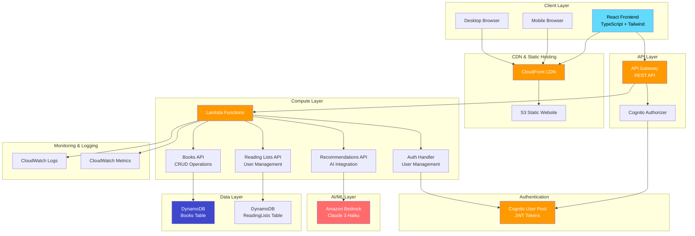

# 🏗 System Architecture

## Overview

The Library Recommendation System follows a modern serverless architecture pattern using AWS cloud services. The system is designed for scalability, cost-effectiveness, and high availability.

## High-Level Architecture



## Component Details

### Frontend Layer

**Technology Stack:**

- React 19 with TypeScript 5.9
- Vite for build tooling
- Tailwind CSS for styling
- React Router v7 for navigation

**Key Features:**

- Server-side rendering ready
- Mobile-first responsive design
- Progressive Web App capabilities
- Optimized bundle splitting

### CDN & Static Hosting

**CloudFront Distribution:**

- Global edge locations for low latency
- HTTPS redirect and security headers
- Gzip compression enabled
- Custom error pages for SPA routing

**S3 Static Website:**

- Cost-effective static hosting
- Versioned deployments
- Public read access with bucket policies

### API Gateway

**Configuration:**

- REST API with resource-based routing
- CORS enabled for web clients
- Request/response transformation
- API throttling and rate limiting

**Endpoints:**

```
GET    /getBooks           - Retrieve all books
GET    /getBooks/{id}      - Get specific book
POST   /books              - Create book (Admin)
PUT    /books/{id}         - Update book (Admin)
DELETE /books/{id}         - Delete book (Admin)
GET    /reading-lists      - Get user's lists
POST   /reading-lists      - Create reading list
PUT    /reading-lists/{id} - Update reading list
DELETE /reading-lists/{id} - Delete reading list
POST   /recommendations    - Get AI recommendations
```

### Lambda Functions

**Books API Lambda:**

- Runtime: Node.js 20.x
- Memory: 512 MB
- Timeout: 30 seconds
- Permissions: DynamoDB read/write

**Reading Lists API Lambda:**

- Runtime: Node.js 20.x
- Memory: 256 MB
- Timeout: 15 seconds
- Permissions: DynamoDB read/write

**Recommendations API Lambda:**

- Runtime: Node.js 20.x
- Memory: 1024 MB
- Timeout: 30 seconds
- Permissions: Bedrock invoke, DynamoDB read

**Performance Optimizations:**

- Connection pooling for DynamoDB
- Efficient error handling
- Structured logging for monitoring
- Cold start optimization

### Data Layer

**Books Table (DynamoDB):**

```
Partition Key: id (String)
Attributes:
- title (String)
- author (String)
- genre (String)
- description (String)
- coverImage (String)
- rating (Number)
- publishedYear (Number)
- isbn (String)
```

**ReadingLists Table (DynamoDB):**

```
Partition Key: userId (String)
Sort Key: id (String)
Attributes:
- name (String)
- description (String)
- bookIds (String Set)
- createdAt (String)
- updatedAt (String)

Global Secondary Index:
- id-index (Partition Key: id)
```

### AI/ML Integration

**Amazon Bedrock Configuration:**

- Model: Claude 3 Haiku (anthropic.claude-3-haiku-20240307-v1:0)
- Region: us-east-1
- Max Tokens: 1000 (cost optimized)
- Temperature: 0.7 for balanced creativity

**Cost Optimization:**

- Claude 3 Haiku: ~$0.25 per 1M input tokens
- 5x cheaper than Claude 3.7 Sonnet
- Optimized prompts to minimize token usage
- Request caching for similar queries

### Authentication & Authorization

**Cognito User Pool:**

- Email-based authentication
- Password policies enforced
- Email verification required
- JWT token-based sessions

**Authorization Flow:**

1. User authenticates with Cognito
2. Receives JWT tokens (ID, Access, Refresh)
3. Frontend includes ID token in API requests
4. API Gateway validates token with Cognito
5. Lambda receives user context from validated token

### Monitoring & Observability

**CloudWatch Integration:**

- Structured JSON logging
- Performance metrics tracking
- Error rate monitoring
- Custom dashboards

**Key Metrics:**

- API response times
- Lambda cold starts
- DynamoDB read/write capacity
- Bedrock API latency
- Error rates by endpoint

## Security Architecture

### Network Security

- HTTPS everywhere (TLS 1.2+)
- CloudFront security headers
- API Gateway throttling
- CORS properly configured

### Authentication Security

- JWT tokens with expiration
- Secure token storage
- Password complexity requirements
- Email verification mandatory

### Data Security

- DynamoDB encryption at rest
- IAM least privilege access
- No sensitive data in logs
- Input validation and sanitization

### API Security

- Rate limiting per user
- Request size limits
- SQL injection prevention
- XSS protection headers

## Scalability & Performance

### Auto Scaling

- Lambda: Automatic concurrency scaling
- DynamoDB: On-demand billing mode
- API Gateway: Built-in scaling
- CloudFront: Global edge network

### Performance Optimizations

- Frontend code splitting
- Image optimization
- CDN caching strategies
- Database query optimization

### Cost Optimization

- Serverless pay-per-use model
- DynamoDB on-demand pricing
- S3 lifecycle policies
- CloudFront edge caching

## Deployment Architecture

### CI/CD Pipeline


### Environment Management

- **Development**: Local development with mock data (http://localhost:5173)
- **Staging**: AWS environment with test data
- **Production**: Full AWS deployment with real data (https://dvzgwma5xw8tz.cloudfront.net)

### Infrastructure as Code

- AWS CDK for infrastructure management
- Version-controlled infrastructure
- Automated deployments with CodePipeline
- Environment-specific configurations
- S3 bucket: `library-app-frontend-uzaydemir`
- CloudFront Distribution ID: `E26S2ES1F8FJ0`

## Disaster Recovery

### Backup Strategy

- DynamoDB point-in-time recovery
- S3 versioning enabled
- CloudFormation stack backups
- Code repository redundancy

### Recovery Procedures

- RTO (Recovery Time Objective): < 1 hour
- RPO (Recovery Point Objective): < 15 minutes
- Automated failover procedures
- Health check monitoring

## Future Enhancements

### Planned Features

- Real-time notifications
- Advanced search with Elasticsearch
- Machine learning personalization
- Mobile app development

### Scalability Improvements

- Multi-region deployment
- Database sharding strategies
- Microservices architecture
- Event-driven architecture

---

_This architecture supports the current application requirements while providing a foundation for future growth and scalability._
