# Library Recommendation System - Architecture

## System Overview

The Library Recommendation System is built using AWS serverless architecture, providing a scalable, cost-effective solution for book recommendations and library management.

## Architecture Diagram

```mermaid
graph TB
    %% User Layer
    User[👤 User] --> CF[☁️ CloudFront CDN]

    %% Frontend Layer
    CF --> S3[📦 S3 Static Website<br/>React + TypeScript]

    %% API Layer
    S3 --> APIG[🚪 API Gateway<br/>REST API Endpoints]

    %% Authentication
    S3 --> Cognito[🔐 Cognito User Pool<br/>Authentication & Authorization]
    APIG --> Cognito

    %% Lambda Functions
    APIG --> L1[⚡ Get Books Lambda]
    APIG --> L2[⚡ Get Book Lambda]
    APIG --> L3[⚡ Create Book Lambda]
    APIG --> L4[⚡ Reading Lists Lambda]
    APIG --> L5[⚡ AI Recommendations Lambda]

    %% Database Layer
    L1 --> DDB1[🗄️ Books Table<br/>DynamoDB]
    L2 --> DDB1
    L3 --> DDB1
    L4 --> DDB2[🗄️ Reading Lists Table<br/>DynamoDB]

    %% AI Layer
    L5 --> Bedrock[🤖 Amazon Bedrock<br/>Claude 3 Haiku Model]

    %% Styling
    classDef frontend fill:#e1f5fe
    classDef api fill:#f3e5f5
    classDef lambda fill:#fff3e0
    classDef database fill:#e8f5e8
    classDef ai fill:#fce4ec
    classDef auth fill:#fff8e1

    class User,CF,S3 frontend
    class APIG api
    class L1,L2,L3,L4,L5 lambda
    class DDB1,DDB2 database
    class Bedrock ai
    class Cognito auth
```



## Component Details

### 1. Frontend Layer (Blue)

#### CloudFront CDN

- **Purpose**: Global content delivery network
- **Benefits**: Fast loading times, HTTPS termination, caching
- **Configuration**: Points to S3 origin, custom error pages for SPA routing

#### S3 Static Website

- **Purpose**: Hosts the React application
- **Technology**: React 19 + TypeScript + Vite
- **Features**: Static website hosting, public read access
- **Build Process**: `npm run build` creates optimized production bundle

### 2. API Layer (Purple)

#### API Gateway

- **Purpose**: RESTful API endpoints with CORS
- **Endpoints**:
  - `GET /getBooks` - Retrieve all books
  - `GET /getBooks/{id}` - Get single book
  - `POST /books` - Create new book (admin only)
  - `GET /reading-lists` - Get user's reading lists
  - `POST /reading-lists` - Create reading list
  - `PUT /reading-lists/{id}` - Update reading list
  - `DELETE /reading-lists/{id}` - Delete reading list
  - `POST /recommendations` - Get AI recommendations

### 3. Compute Layer (Orange)

#### Lambda Functions

All functions use Node.js 20.x runtime with ARM64 architecture for cost optimization.

##### Get Books Lambda

- **Purpose**: Retrieve all books from DynamoDB
- **Memory**: 256 MB
- **Timeout**: 30 seconds
- **Permissions**: DynamoDB:Scan on Books table

##### Get Book Lambda

- **Purpose**: Retrieve single book by ID
- **Memory**: 256 MB
- **Timeout**: 30 seconds
- **Permissions**: DynamoDB:GetItem on Books table

##### Create Book Lambda

- **Purpose**: Add new books to catalog (admin only)
- **Memory**: 256 MB
- **Timeout**: 30 seconds
- **Permissions**: DynamoDB:PutItem on Books table
- **Authorization**: Requires admin role in Cognito

##### Reading Lists Lambda

- **Purpose**: CRUD operations for user reading lists
- **Memory**: 256 MB
- **Timeout**: 30 seconds
- **Permissions**: DynamoDB:Query, PutItem, UpdateItem, DeleteItem on ReadingLists table
- **Authorization**: Requires valid Cognito JWT token

##### AI Recommendations Lambda

- **Purpose**: Generate personalized book recommendations
- **Memory**: 512 MB (higher for AI processing)
- **Timeout**: 60 seconds
- **Permissions**: Bedrock:InvokeModel
- **Model**: Claude 3 Haiku (cost-effective, fast responses)

### 4. Database Layer (Green)

#### Books Table (DynamoDB)

- **Partition Key**: `id` (String)
- **Attributes**:
  - `title` (String)
  - `author` (String)
  - `genre` (String)
  - `description` (String)
  - `coverImage` (String)
  - `rating` (Number)
  - `publishedYear` (Number)
  - `isbn` (String)

#### Reading Lists Table (DynamoDB)

- **Partition Key**: `userId` (String)
- **Sort Key**: `id` (String)
- **Attributes**:
  - `name` (String)
  - `description` (String)
  - `bookIds` (List of Strings)
  - `createdAt` (String)
  - `updatedAt` (String)

### 5. Authentication Layer (Yellow)

#### Cognito User Pool

- **Purpose**: User registration, authentication, and authorization
- **Features**:
  - Email-based registration
  - Password policies
  - JWT token generation
  - User roles (user, admin)
- **Integration**: API Gateway uses Cognito authorizer for protected endpoints

### 6. AI Layer (Pink)

#### Amazon Bedrock

- **Model**: Claude 3.7 Haiku
- **Purpose**: Generate contextual book recommendations
- **Input**: User query describing preferences
- **Output**: List of recommended books with reasons
- **Cost**: ~$0.01 per recommendation (very cost-effective)

## Data Flow

### 1. User Authentication Flow

```
User → CloudFront → S3 → Cognito User Pool → JWT Token → Local Storage
```

### 2. Book Browsing Flow

```
User → CloudFront → S3 → API Gateway → Get Books Lambda → Books DynamoDB → Response
```

### 3. Reading List Management Flow

```
User → CloudFront → S3 → API Gateway → Cognito Authorizer → Reading Lists Lambda → ReadingLists DynamoDB
```

### 4. AI Recommendations Flow

```
User → CloudFront → S3 → API Gateway → Cognito Authorizer → AI Lambda → Bedrock → Claude 3 Haiku → Response
```

## Security Considerations

### 1. Authentication & Authorization

- All sensitive endpoints protected by Cognito JWT tokens
- Admin-only endpoints check user role in token claims
- API Gateway validates tokens before reaching Lambda functions

### 2. Data Protection

- DynamoDB tables use AWS managed encryption
- S3 bucket configured with appropriate access policies
- CloudFront enforces HTTPS

### 3. Network Security

- API Gateway configured with CORS for frontend domain only
- Lambda functions run in AWS managed VPC
- No direct database access from frontend

## Cost Optimization

### 1. Serverless Architecture

- Pay only for actual usage (requests, compute time)
- No idle server costs
- Automatic scaling based on demand

### 2. ARM64 Lambda Functions

- 20% better price-performance compared to x86
- Lower memory allocation where possible

### 3. DynamoDB On-Demand

- Pay per request model
- No capacity planning required
- Automatic scaling

### 4. CloudFront Caching

- Reduces origin requests
- Faster response times
- Lower bandwidth costs

## Monitoring & Observability

### 1. CloudWatch Logs

- All Lambda functions log to CloudWatch
- API Gateway access logs enabled
- Error tracking and debugging

### 2. CloudWatch Metrics

- Lambda duration, errors, invocations
- API Gateway request count, latency, errors
- DynamoDB read/write capacity utilization

### 3. X-Ray Tracing (Optional)

- End-to-end request tracing
- Performance bottleneck identification
- Service map visualization

## Deployment Strategy

### 1. Infrastructure as Code

- AWS CDK for infrastructure deployment
- Version controlled infrastructure changes
- Consistent environments (dev, staging, prod)

### 2. CI/CD Pipeline

- GitHub Actions for automated deployment
- Separate pipelines for frontend and backend
- Automated testing before deployment

### 3. Blue-Green Deployment

- Zero-downtime deployments
- Easy rollback capability
- Lambda alias-based traffic shifting

## Scalability Considerations

### 1. Horizontal Scaling

- Lambda functions scale automatically
- DynamoDB scales based on demand
- CloudFront global edge locations

### 2. Performance Optimization

- DynamoDB single-table design for efficiency
- Lambda cold start optimization
- CloudFront caching strategy

### 3. Future Enhancements

- ElastiCache for frequently accessed data
- DynamoDB Global Tables for multi-region
- API Gateway caching for read-heavy endpoints

## Technology Stack Summary

| Layer      | Technology                   | Purpose                  |
| ---------- | ---------------------------- | ------------------------ |
| Frontend   | React 19 + TypeScript + Vite | User interface           |
| CDN        | CloudFront                   | Content delivery         |
| Storage    | S3                           | Static website hosting   |
| API        | API Gateway                  | RESTful endpoints        |
| Compute    | Lambda (Node.js 20.x)        | Business logic           |
| Database   | DynamoDB                     | NoSQL data storage       |
| Auth       | Cognito                      | User management          |
| AI         | Bedrock (Claude 3 Haiku)     | Book recommendations     |
| Monitoring | CloudWatch                   | Logging and metrics      |
| Deployment | CDK + GitHub Actions         | Infrastructure and CI/CD |

This architecture provides a robust, scalable, and cost-effective solution for the Library Recommendation System while maintaining high availability and security standards.
