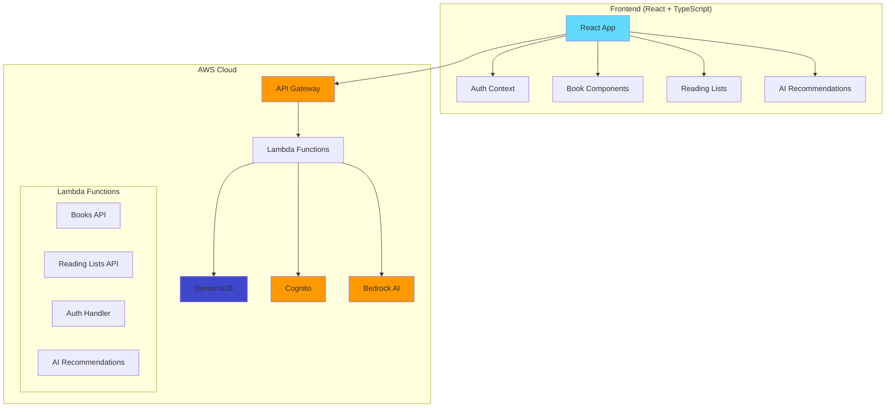

# 🤖 AI-Powered Library Recommendation System

[](https://zj5w3d20sj.execute-api.us-east-1.amazonaws.com/prod)
[](https://github.com/spaceiron/library-recommendation-system)
[](LICENSE)
[](https://aws.amazon.com/)

> **Modern, AI-powered library management system built with React, TypeScript, and AWS serverless architecture**

## 🚀 Live Demo

**🌐 [Visit Live Application](https://zj5w3d20sj.execute-api.us-east-1.amazonaws.com/prod)**

## 📋 Table of Contents

- [Features](#-features)
- [Tech Stack](#-tech-stack)
- [Architecture](#-architecture)
- [Getting Started](#-getting-started)
- [AWS Setup](#-aws-setup)
- [API Documentation](#-api-documentation)
- [Testing](#-testing)
- [Deployment](#-deployment)
- [Contributing](#-contributing)
- [License](#-license)

## ✨ Features

### 🔐 User Authentication

- **Secure signup/login** with AWS Cognito
- **Email verification** and password reset
- **Role-based access** (User/Admin)

### 📚 Book Management

- **Browse catalog** with advanced search and filters
- **Detailed book pages** with ratings, reviews, and descriptions
- **Admin panel** for catalog management
- **Responsive design** optimized for all devices

### 📖 Reading Lists

- **Create custom lists** for organizing books
- **Add/remove books** with intuitive interface
- **Persistent storage** with real-time updates
- **Share lists** with other users

### 🤖 AI Recommendations

- **Intelligent suggestions** powered by Amazon Bedrock
- **Personalized recommendations** based on reading history
- **Natural language queries** for finding books
- **Machine learning** algorithms for improved accuracy

### 🎨 Modern UI/UX

- **Beautiful design** with Tailwind CSS
- **Dark/light themes** with smooth transitions
- **Mobile-first** responsive design
- **Accessibility compliant** (WCAG 2.1)

## 🛠 Tech Stack

### Frontend

- **React 19** - Modern UI library with latest features
- **TypeScript 5.9** - Type-safe development
- **Vite** - Lightning-fast build tool
- **Tailwind CSS** - Utility-first styling
- **React Router v7** - Client-side routing

### Backend & Cloud

- **AWS Lambda** - Serverless compute
- **Amazon DynamoDB** - NoSQL database
- **Amazon Cognito** - Authentication service
- **Amazon Bedrock** - AI/ML recommendations
- **API Gateway** - RESTful API management
- **AWS CDK** - Infrastructure as Code

### Development & Testing

- **Vitest** - Unit testing framework
- **React Testing Library** - Component testing
- **ESLint & Prettier** - Code quality tools
- **GitHub Actions** - CI/CD pipeline

## 🏗 Architecture



## 🚀 Getting Started

### Prerequisites

- **Node.js 18+** and npm
- **AWS Account** with appropriate permissions
- **Git** for version control

### Local Development

1. **Clone the repository**

   ```bash
   git clone https://github.com/spaceiron/library-recommendation-system.git
   cd library-recommendation-system
   ```

2. **Install dependencies**

   ```bash
   npm install
   ```

3. **Set up environment variables**

   ```bash
   cp .env.example .env
   # Edit .env with your AWS configuration
   ```

4. **Start development server**

   ```bash
   npm run dev
   ```

5. **Open your browser**
   ```
   http://localhost:5173
   ```

### Environment Variables

Create a `.env` file in the root directory:

```env
VITE_API_BASE_URL=your-api-gateway-url
VITE_AWS_REGION=us-east-1
VITE_COGNITO_USER_POOL_ID=your-user-pool-id
VITE_COGNITO_CLIENT_ID=your-client-id
```

## ☁️ AWS Setup

### Quick Setup (Recommended)

1. **Install AWS CDK**

   ```bash
   npm install -g aws-cdk
   ```

2. **Configure AWS credentials**

   ```bash
   aws configure
   ```

3. **Deploy infrastructure**
   ```bash
   cd infrastructure
   npm install
   cdk deploy --all
   ```

### Manual Setup

Follow the detailed guide in [AWS_SETUP.md](AWS_SETUP.md) for step-by-step instructions.

## 📡 API Documentation

### Books API

- `GET /getBooks` - Retrieve all books
- `GET /getBooks/{id}` - Get specific book
- `POST /books` - Create new book (Admin only)
- `PUT /books/{id}` - Update book (Admin only)
- `DELETE /books/{id}` - Delete book (Admin only)

### Reading Lists API

- `GET /reading-lists` - Get user's reading lists
- `POST /reading-lists` - Create new reading list
- `PUT /reading-lists/{id}` - Update reading list
- `DELETE /reading-lists/{id}` - Delete reading list

### AI Recommendations API

- `POST /recommendations` - Get AI-powered book recommendations

## 🧪 Testing

### Run Tests

```bash
# Unit tests
npm run test

# Test with UI
npm run test:ui

# Coverage report
npm run test:coverage
```

### Test Structure

```
src/tests/
├── components/     # Component tests
├── pages/         # Page tests
├── services/      # API service tests
└── utils/         # Utility function tests
```

## 🚀 Deployment

### Automated Deployment (GitHub Actions)

1. **Set up GitHub Secrets**
   - `AWS_ACCESS_KEY_ID`
   - `AWS_SECRET_ACCESS_KEY`
   - `AWS_REGION`

2. **Push to main branch**
   ```bash
   git push origin main
   ```

### Manual Deployment

1. **Build the application**

   ```bash
   npm run build
   ```

2. **Deploy to AWS**
   ```bash
   cd infrastructure
   cdk deploy --all
   ```

## 📊 Project Status

- ✅ **Frontend Development** - Complete
- ✅ **AWS Infrastructure** - Complete
- ✅ **Authentication** - Complete
- ✅ **Books API** - Complete
- ✅ **Reading Lists** - Complete
- 🔄 **AI Recommendations** - In Progress
- 📋 **Testing** - Ongoing

## 🤝 Contributing

1. **Fork the repository**
2. **Create feature branch** (`git checkout -b feature/amazing-feature`)
3. **Commit changes** (`git commit -m 'Add amazing feature'`)
4. **Push to branch** (`git push origin feature/amazing-feature`)
5. **Open Pull Request**

## 📄 License

This project is licensed under the MIT License - see the [LICENSE](LICENSE) file for details.

## 🙏 Acknowledgments

- **AWS** for providing excellent cloud services
- **React Team** for the amazing framework
- **Tailwind CSS** for beautiful styling utilities
- **Open Source Community** for inspiration and tools

## 📞 Contact

**GitHub**: [@spaceiron](https://github.com/spaceiron)

---

⭐ **Star this repository if you found it helpful!**
